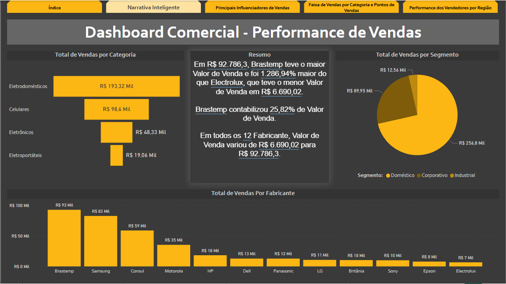

# 📊 Dashboard Comercial – Power BI

Este projeto apresenta um dashboard interativo desenvolvido com Power BI, focado na **análise de vendas e desempenho comercial**.  
Ele permite visualizar rapidamente os principais indicadores do negócio e facilita a tomada de decisões estratégicas.

---

## 🎯 Objetivos

- Acompanhar o volume de vendas por região, produto e representante  
- Identificar variações de performance ao longo do tempo  
- Avaliar metas versus resultados  
- Monitorar ticket médio e margem por canal

---

## 🛠️ Tecnologias utilizadas

- **Power BI Desktop**
- **Power Query** – tratamento e transformação dos dados
- **DAX** – criação de medidas e KPIs
- **Excel / CSV** – fontes de dados

---

## 📸 Capturas de Tela

### 🧩 Capa

### 💬 Narrativa Inteligente

### 📈 Influenciadores de Vendas

---

## 📁 Download dos Arquivos

Você pode baixar o projeto e a base de dados.  
**Atenção:** salve os dois arquivos na mesma pasta para que o `.pbix` funcione corretamente.

- 📥 [`mini-projeto-comercial.pbix`](./mini-projeto-comercial.pbix)  
- 📥 [`Dados_Comerciais.xlsx`](./Dados_Comerciais.xlsx)

---

## 💡 Possíveis Evoluções

- Conexão com dados em nuvem (ex: SQL Server ou APIs REST)
- Publicação no Power BI Service com agendamento automático
- Versão mobile otimizada para smartphones
- Filtros dinâmicos por período, canal e região

---

## 👤 Autor

**Flavio José Ribeiro da Silva**  
📞 +55 11 99353-5702  
✉️ flaviojsilva0887@gmail.com  
🔗 [LinkedIn](https://www.linkedin.com/in/flavio-jose-ribeiro-da-silva-6258b77b/)
